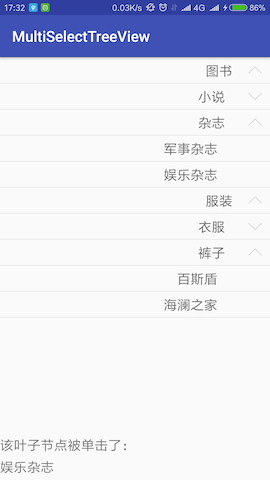
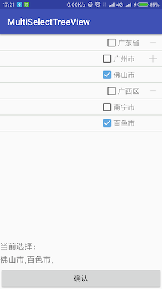

# MutiSelectTreeView

基于 RecyclerView 封装的 Android TreeView,支持单选，多选，支持节点文本字体大小，
字体颜色，分割线高度，分割线颜色等属性的自定义

使用示例1： 

在 XML 中声明 AndroidTreeView:

       <com.ezreal.treevieewlib.AndroidTreeView
            android:id="@+id/tree_view"
            android:layout_width="match_parent"
            android:layout_height="0dp"
            android:layout_weight="1"/>
            
在 JAVA 代码中设置 AndroidTreeView 的属性，最后绑定数据：

        // findViewById获得控件实例
        AndroidTreeView treeView = findViewById(R.id.tree_view);
        treeView.setNodeIdFormat(NodeIDFormat.LONG); // 声明 bean 中id pid 字段类型，必选
        treeView.setMultiSelEnable(false);   // 设置关闭多选，默认关闭，可选
        
        // 在单选状态下，通过监听叶子节点单击事件，得到选中的节点
        treeView.setTreeNodeClickListener(new OnTreeNodeClickListener() {
            @Override
            public void OnLeafNodeClick(TreeNode node, int position) {
                result.setText(node.getTitle());
            }
        });

        // 绑定数据，注意：本行需要写在为 treeView 设置属性之后
        // 在本行之后任何 setXXX 都不起作用
        treeView.bindData(testData());
                                        
               

使用示例2： 

直接使用 JAVA 代码实例化 AndroidTreeView 实例并添加到布局中

        // 通过构造方法实例化
        mTreeView = new AndroidTreeView(this);
        // 设置开启多选，默认为关闭,可选
        mTreeView.setMultiSelEnable(true);
        // 设置当前bean 中 id pid 的类型为 String，必选，默认为 long
        mTreeView.setNodeIdFormat(NodeIDFormat.STRING);
        
        mTreeView.setTitleTextColor("#8a8a8a");             // 设置显示文本字体颜色，可选
        mTreeView.setTitleTextSize(16);                     // 设置显示文本字体大小，可选
        mTreeView.setOpenIconRes(R.mipmap.icon_node_open);  // 设置节点打开时显示的图标，可选，
        mTreeView.setCloseIconRes(R.mipmap.icon_node_close);// 设置节点关闭时显示的图标，可选
        mTreeView.setLevelPadding(10);                       // 设置层级缩进大小，可选
        mTreeView.setIntervalColor("#aabbaa");              // 设置节点间隔线颜色，可选
        mTreeView.setIntervalHeight(0.8f);                   // 设置节点间隔线高度，可选
        
        // 绑定数据，必须在最后一步调用，否则上述自定义数据将无效
        mTreeView.bindData(testData());
        
        // 将 TreeView 添加到 FrameLayout 中显示
        layout.addView(mTreeView);
        
        btnConfirm.setOnClickListener(new View.OnClickListener() {
            @Override
            public void onClick(View v) {
                if (mTreeView != null){
                    // 在多选状态时，通过 getSelected 可以获取当前所选的叶子节点的集合
                    List<TreeNode> selected = mTreeView.getSelected();

                    StringBuilder builder = new StringBuilder();
                    for (TreeNode node : selected){
                        builder.append(node.getTitle());
                        builder.append(",");
                    }
                    result.setText(builder.toString());
                }
            }
        });
        

